# MySQL学习Day1

## 概述

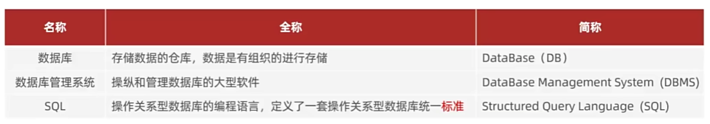

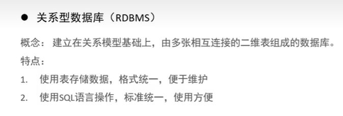

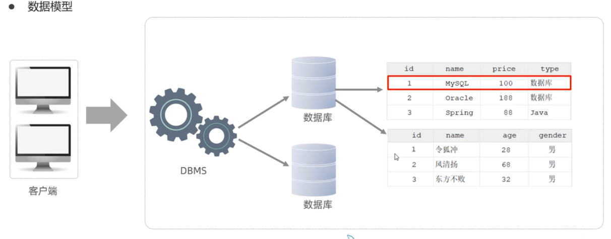

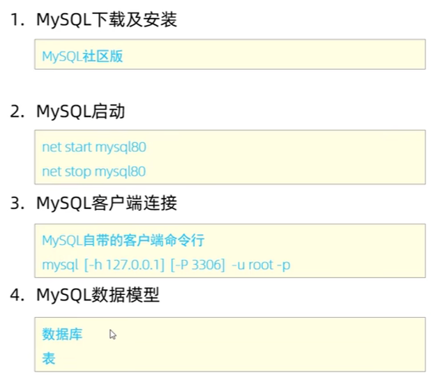

### mysql启动

1. WIN + R : services.msc 找到MySQL80 右键启动
2. 命令行(需要管理员权限)：net start mysql80

### 客户端连接

1. 直接打开MySQL提供的 MySQL 8.0 Command Line Client
2. 命令行(需要管理员权限)：mysql -u -root -p

## SQL

### SQL通用语法和分类

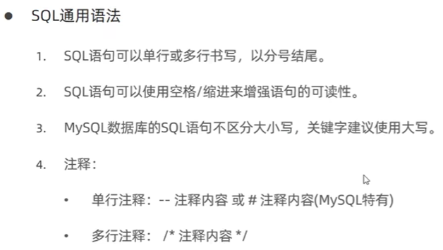

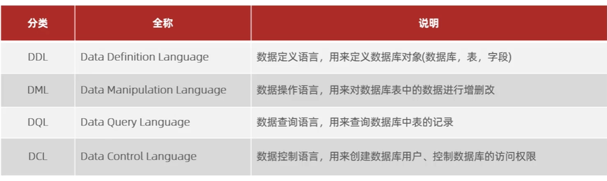

### DDL

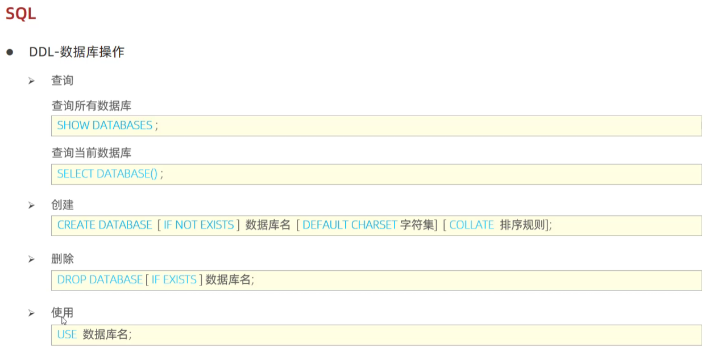

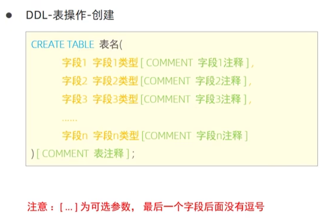

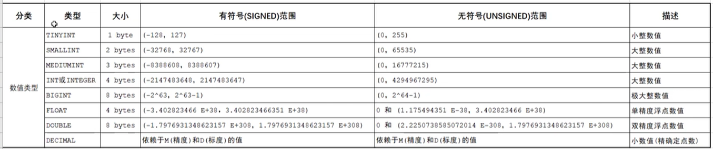

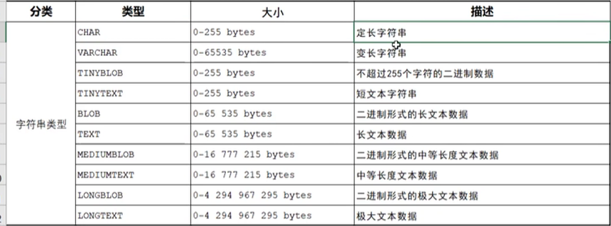

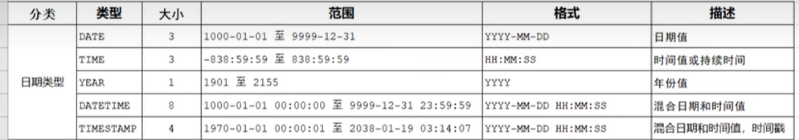

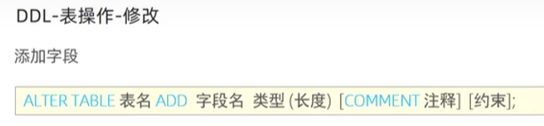

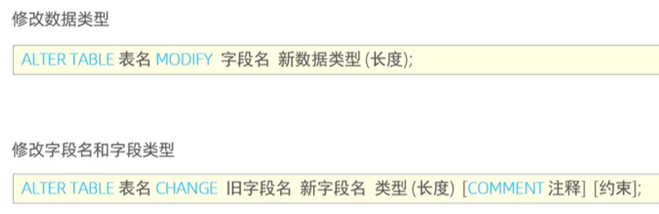

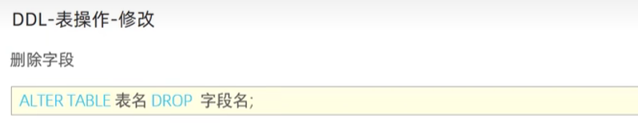

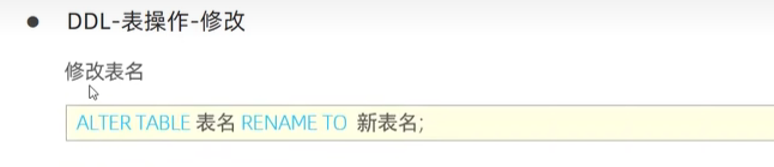

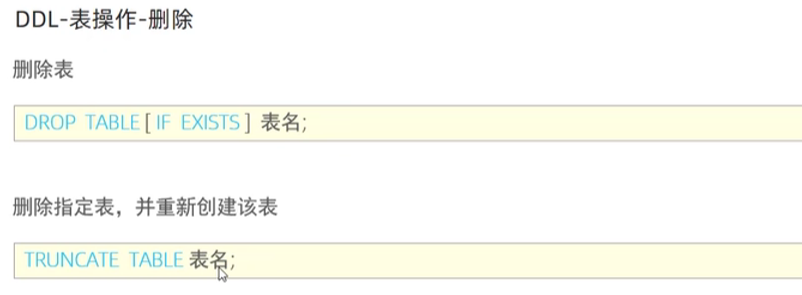

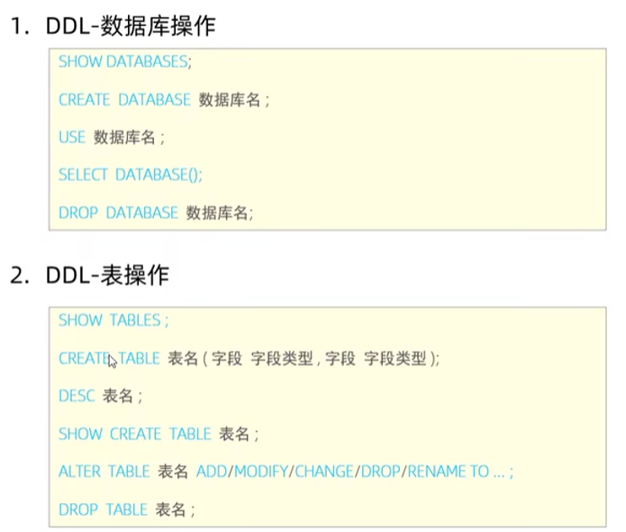
