# MySQL学习Day3

## 函数

### 字符串函数

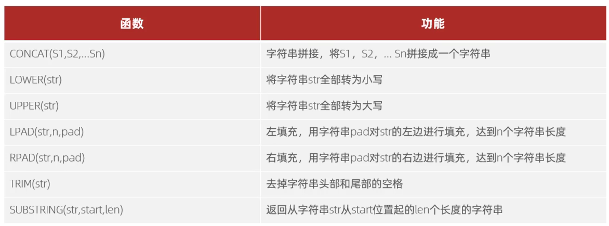

### 数值函数

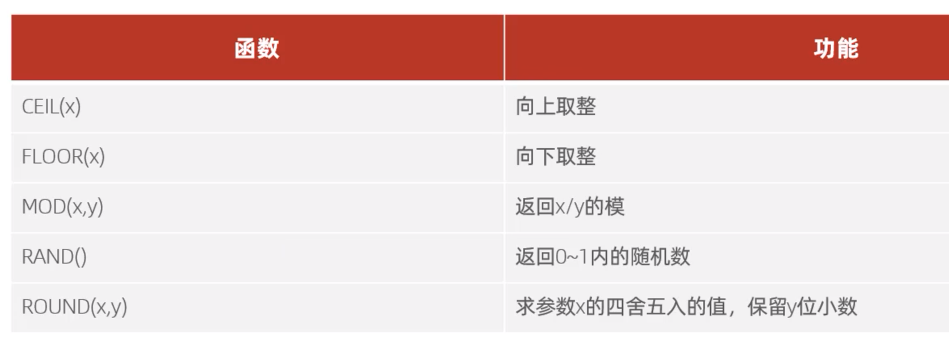

### 日期函数

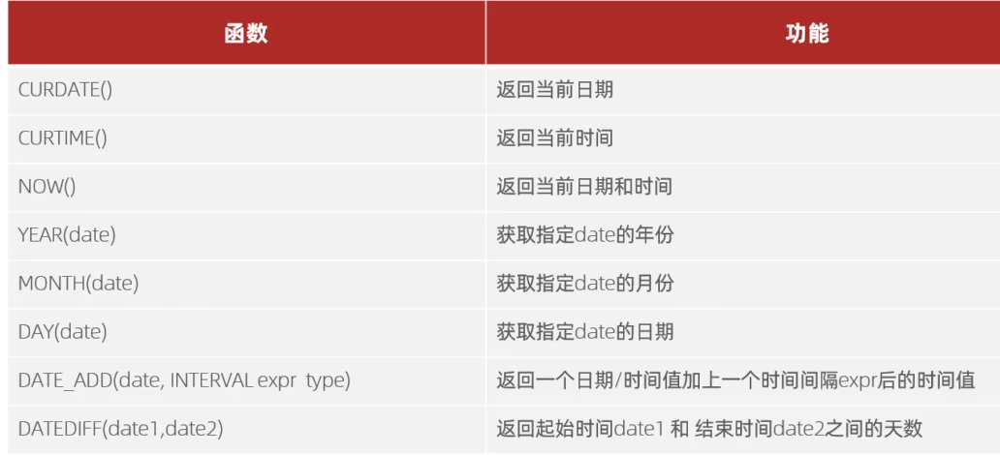

### 流程函数

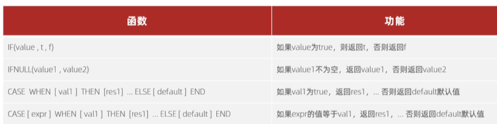

## 约束

### 概述

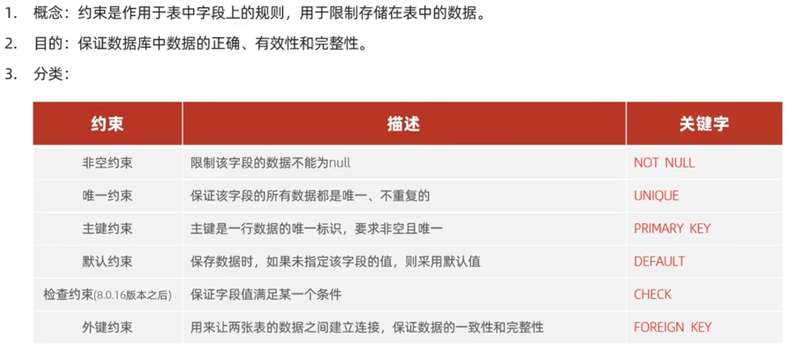

### 外键约束

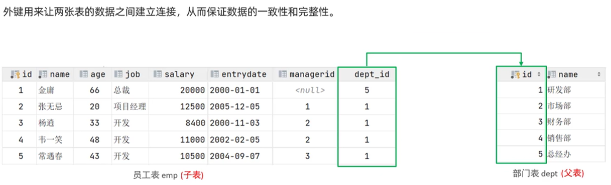

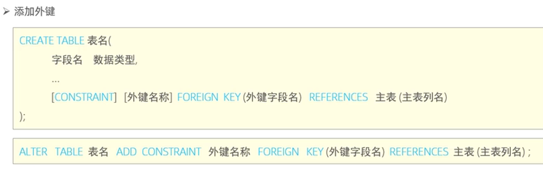

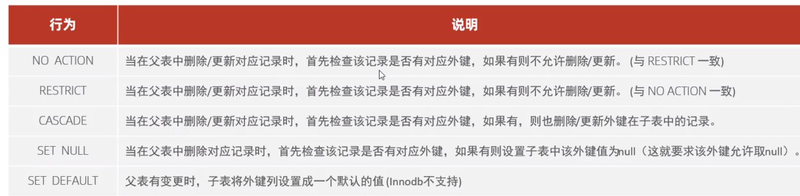

## 多表查询

### 多表关系

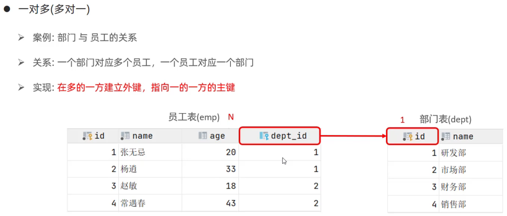

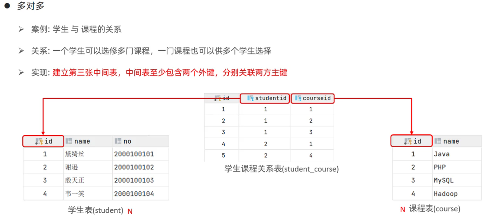

### 多表查询概述

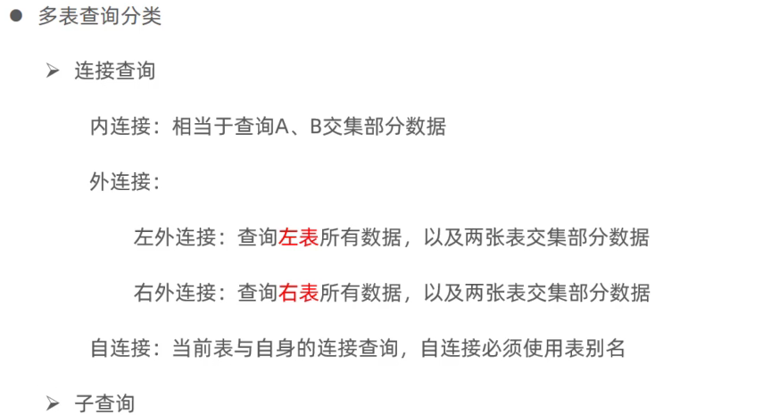

### 内连接

### 外连接

### 自连接

### 联合查询-union

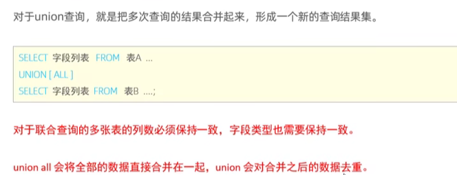

### 子查询

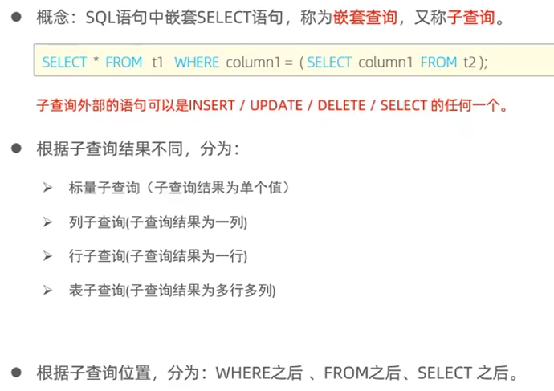

#### 标量子查询

#### 列子查询

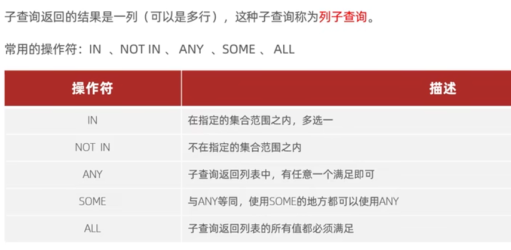

#### 行子查询

#### 表子查询

### 多表查询总结

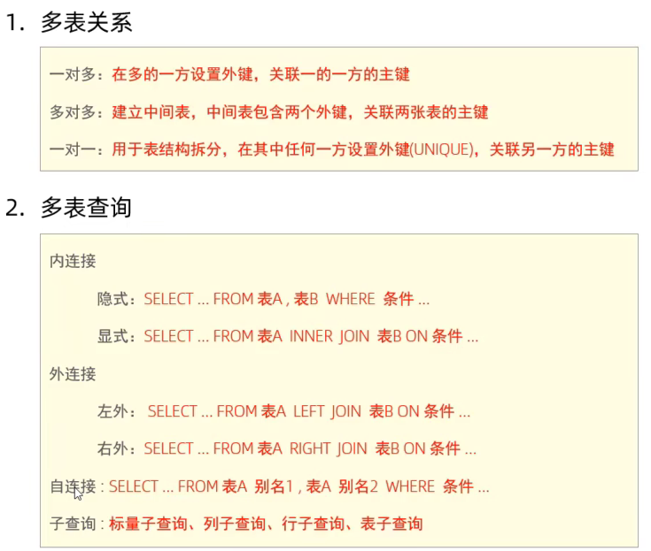

## 事务

### 事务操作

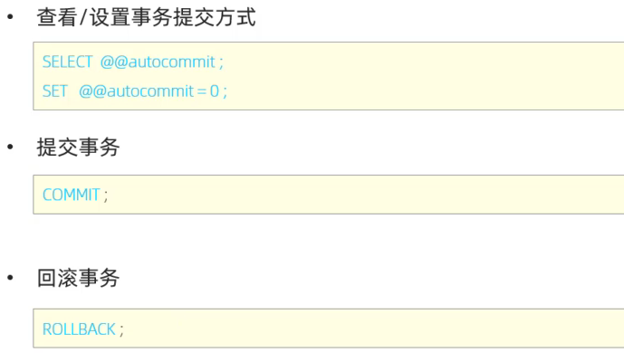

### 事务四大特性

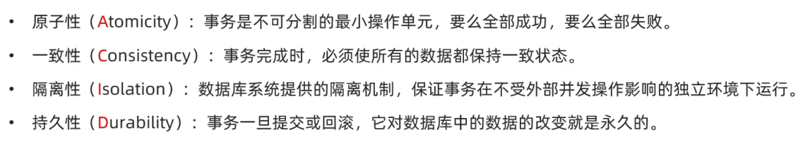

### 并发事务问题

### 事务隔离级别

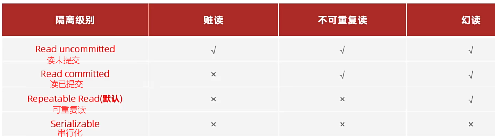

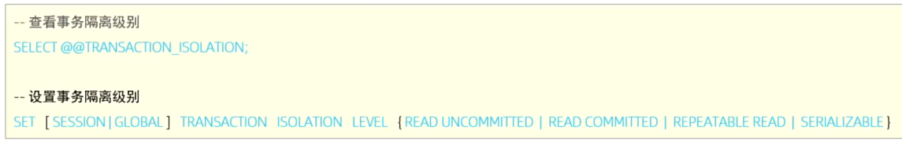

